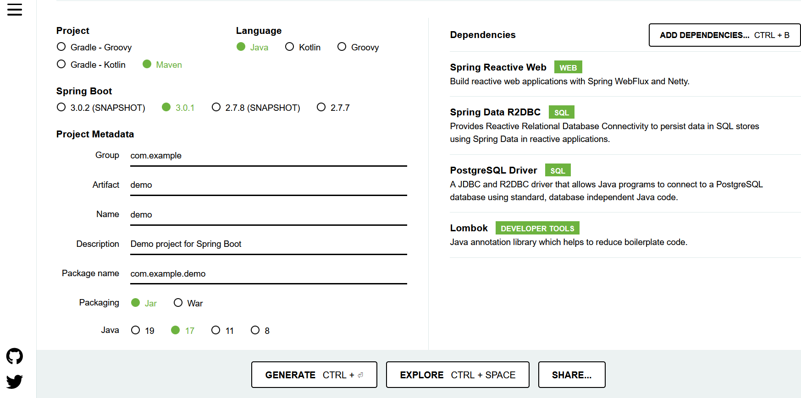

# Building Chat Application with R2dbc and Postgres

In previous blog posts, I have demonstrated how to use Angular/Spring WebFlux to build a simple and stupid Chat application with varied protocols, including [SSE](https://medium.com/zero-equals-false/building-a-chat-application-with-angular-and-spring-reactive-sse-c0fdddcd7d70), [WebSocket](https://medium.com/zero-equals-false/building-a-chat-application-with-angular-and-spring-reactive-websocket-part-2-ad140125cbd2), and [RSocket](https://medium.com/swlh/building-a-chat-application-with-angular-and-spring-rsocket-3cd8013f2f55). We also introduced the specific Postgres/R2dbc feature in [a previous post](https://medium.com/zero-equals-false/dealing-with-postgres-specific-json-enum-type-and-notifier-listener-with-r2dbc-f15cc104aa10), Postgres itself can be used as simple message broker.

In this post, we will rebuilt a Chat application as the former applications, but with R2dbc and the Postgres specific `NOTIFY` and `LISTEN` statement.

## Generating Spring WebFlux Project

Open your browser, go to [Spring Initilizr](http://start.spring.io) page, customize the project.

* Project: Maven (since Spring Boot 3.0, the build tool is switched to Gradle by default in this starter UI)
* Language: Java
* Dependencies: Spring Reactive Web, Spring Data R2dbc, Postgres Driver, Lombok



Click the *EXPLORE* button, you can preview the project structure in new dialog. Hit the *GENERATE* button to export the project skeleton codes into a zip archive for downloading.

Download the project archive and extract the files into your disc, and import into your IDE, eg. IDEA or VSCode with Spring Tools.

## Building Chat Application

Declares a `Message` class as payload format that is sent from the Postgres `NOTIFY` and received in a `LISTEN`.

```java
record Message(UUID id, String body, LocalDateTime sentAt) {
}
```

Create a `Notifier` and `Listener` to perform the  `NOTIFY` and `LISTEN` in a Postgres aware SQL statement.

```java
@Component
@Slf4j
@RequiredArgsConstructor
class Notifier {

    private final ConnectionFactory connectionFactory;

    private final ObjectMapper objectMapper;

    PostgresqlConnection sender;

    @PostConstruct
    public void initialize() throws InterruptedException {
        sender = Mono.from(connectionFactory.create())
                .cast(PostgresqlConnection.class)
                .block();
    }

    @SneakyThrows
    public Mono<Void> send(CreateMessageCommand data) {
        var message = new Message(UUID.randomUUID(), data.body(), LocalDateTime.now());
        var messageJson = objectMapper.writeValueAsString(message);

        return sender.createStatement("NOTIFY messages, '" + messageJson + "'")
                .execute()
                .flatMap(PostgresqlResult::getRowsUpdated)
                .log("sending notification::")
                .then();
    }

    @PreDestroy
    public void destroy() {
        sender.close().subscribe();
    }

}

@Component
@Slf4j
@RequiredArgsConstructor
class Listener {

    private final ConnectionFactory connectionFactory;

    private final ObjectMapper objectMapper;

    PostgresqlConnection receiver;

    @PostConstruct
    public void initialize() throws InterruptedException {
        receiver = Mono.from(connectionFactory.create())
                .cast(PostgresqlConnection.class)
                .block();

        receiver.createStatement("LISTEN messages")
                .execute()
                .flatMap(PostgresqlResult::getRowsUpdated)
                .log("listen::")
                .subscribe();
    }

    public Flux<Message> getMessages() {
        return receiver.getNotifications()
                .delayElements(Duration.ofMillis(100))
                .log()
                .map(notification -> {
                    log.debug("received notification: {}", notification);
                    try {
                        return objectMapper.readValue(notification.getParameter(), Message.class);
                    } catch (JsonProcessingException e) {
                        throw new RuntimeException(e);
                    }
                });
    }

    @PreDestroy
    public void destroy() {
        receiver.close().subscribe();
    }

}
```

Next we will create a frontend controller role to send a message and track the messages that is just sent from varied clients. Here, we use `Server Sent Event` protocol to emit the caught messages to clients in time.

Here we will use the programmatic functional APIs to centralize all the handling methods in one class - `MessageHandler`.

```java
@Component
@RequiredArgsConstructor
class MessageHandler {

    private final Notifier notifier;
    private final Listener listener;

    public Mono<ServerResponse> all(ServerRequest req) {
        return ok()
                .contentType(MediaType.TEXT_EVENT_STREAM)
                .body(this.listener.getMessages(), Message.class);
    }

    public Mono<ServerResponse> create(ServerRequest req) {
        return req.bodyToMono(CreateMessageCommand.class)
                .flatMap(this.notifier::send)
                .flatMap(__ -> ok().bodyValue("The message was sent"));
    }

}
```

`CreateMessageCommand` is used to wrap the request body when sending a message.

Then define a `RouterFunction` bean to declare the routing rules.

```java
@Configuration
class WebConfig {

    @Bean
    public RouterFunction<ServerResponse> routes(MessageHandler messageHandler) {
        return route()
                .path("/messages", () -> route()
                                .nest(
                                        path(""),
                                        () -> route()
                                                .GET("", messageHandler::all)
                                                .POST("", messageHandler::create)
                                                .build()
                                )
                ).build();
    }
}

```

In this example project, we do not save the chat messages into the Postgres database that is just used as a simple message broker. You can add it yourself.

And at the same time, we only create the backend API project here, and I have no plan to repeat to create the frontend project, if you are interested in how to connect to our backend API in Angular codes, copy the *client* codes from [angular-spring-sse-sample](https://github.com/hantsy/angular-spring-sse-sample), and experience it yourself.

## Running Application

Before running the application, ensure there is a running Postgres that is ready to connect.

Create a *docker-compose.yaml* file in the project root folder.

```yml
services:
  postgres:
    image: postgres
    ports:
      - "5432:5432"
    restart: always
    environment:
      POSTGRES_PASSWORD: password
      POSTGRES_DB: blogdb
      POSTGRES_USER: user
    volumes:
      - ./data/postgresql:/var/lib/postgresql
      - ./pg-initdb.d:/docker-entrypoint-initdb.d
```

Execute the following command to start a Postgres in Docker using this predefined docker compose file.

Next try to run Spring `Application` class directly in IDE or execute `mvn clean spring-boot:run` in the project root folder to build and run the application.

Open a terminal window, eg. Windows Terminal or CMD.

```bash
curl http://localhost:8080/messages
```

It will be frozen and waiting for messages.

Open another terminal window, use `curl` command to send some sample messages.

```bash
> curl -X POST http://localhost:8080/messages -H "Content-Type: application/json" -d "{\"body\" :\"test\"}"
> curl -X POST http://localhost:8080/messages -H "Content-Type: application/json" -d "{\"body\" :\"test 2\"}"
> curl -X POST http://localhost:8080/messages -H "Content-Type: application/json" -d "{\"body\" :\"test 3\"}"

```

Switch back to the first terminal window, you will see information similar to the following.

```bash
curl http://localhost:8080/messages
data:{"id":"8354fa38-4960-4d09-a4f1-7f0e7eab907a","body":"test","sentAt":"2023-01-14T12:09:49.1174014"}

data:{"id":"88f0d028-410b-40c6-9150-57a2228cb592","body":"test 2","sentAt":"2023-01-14T12:10:47.7973986"}

data:{"id":"8b8e59b6-40c0-4a8a-b291-6205d8a8c1f1","body":"test 3","sentAt":"2023-01-14T12:11:01.4874459"}

```

Get the complete [sample codes](https://github.com/hantsy/spring-r2dbc-sample/tree/master/pg-notifier-listener) from my Github.
