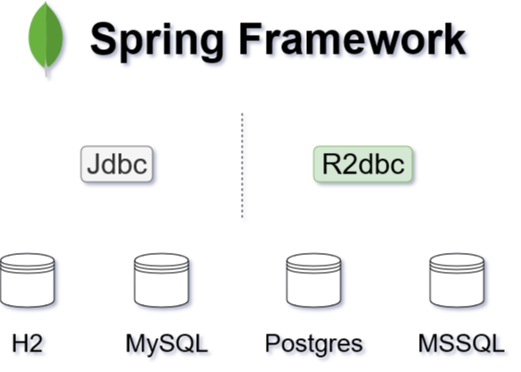

# Working with Relational Database using R2dbc DatabaseClient


In  Spring 5.2 or previous versions, when using relational databases in your applications, you have to use Jdbc or JPA to operate with the databases. Since Spring 5.3, things will be changed. The R2dbc's `DatabaseClient` which is originally part of the Spring Data R2dbc is completely refactored and will be migrated to the core Spring framework.

 To access the relational databases, R2dbc will be an official alternative of Jdbc in the new Spring 5.3.



## Configuring DatabaseClient

To use R2dbc, first of all,  add corresponding drivers into your project dependencies.  Check the [Introduction to R2dbc](./intro.md) for details.

```xml
<dependency>
    <groupId>io.r2dbc</groupId>
    <artifactId>r2dbc-postgresql</artifactId>
</dependency>
```

And make sure you are using the latest Spring 5.3 which is managed by Spring Boot 2.4 BOM, use Spring Boot BOM to simplify the dependency management.

```xml
<parent>
    <groupId>org.springframework.boot</groupId>
    <artifactId>spring-boot-starter-parent</artifactId>
    <version>2.4.0-M3</version>
    <relativePath/> <!-- lookup parent from repository -->
</parent>
```

Also add the following dependencies to create a plain Spring application.

```xml
<!-- spring webflux support -->
<dependency>
    <groupId>org.springframework</groupId>
    <artifactId>spring-context</artifactId>
</dependency>
<dependency>
    <groupId>org.springframework</groupId>
    <artifactId>spring-webflux</artifactId>
</dependency>

<!-- Spring R2dbc -->
<dependency>
    <groupId>org.springframework</groupId>
    <artifactId>spring-r2dbc</artifactId>
</dependency>

<!-- Jackson modules -->
<dependency>
    <groupId>com.fasterxml.jackson.core</groupId>
    <artifactId>jackson-databind</artifactId>
</dependency>
<dependency>
    <groupId>com.fasterxml.jackson.datatype</groupId>
    <artifactId>jackson-datatype-jdk8</artifactId>
</dependency>
<dependency>
    <groupId>com.fasterxml.jackson.datatype</groupId>
    <artifactId>jackson-datatype-jsr310</artifactId>
</dependency>

<!-- Reactor/Netty runtime -->
<dependency>
    <groupId>io.netty</groupId>
    <artifactId>netty-buffer</artifactId>
</dependency>

<dependency>
    <groupId>io.projectreactor.netty</groupId>
    <artifactId>reactor-netty</artifactId>
</dependency>

<!-- Project Lombok: to erase the getter and setters, equals, hashCode, toString in source codes, and clean your codes -->
<dependency>
    <groupId>org.projectlombok</groupId>
    <artifactId>lombok</artifactId>
</dependency>

<!-- logging -->
<dependency>
    <groupId>org.slf4j</groupId>
    <artifactId>slf4j-api</artifactId>
</dependency>
<dependency>
    <groupId>org.slf4j</groupId>
    <artifactId>jcl-over-slf4j</artifactId>
</dependency>
<dependency>
    <groupId>ch.qos.logback</groupId>
    <artifactId>logback-core</artifactId>
</dependency>
<dependency>
    <groupId>ch.qos.logback</groupId>
    <artifactId>logback-classic</artifactId>
</dependency>
```

> In a Spring Boot application, just needs to add *spring-boot-webflux-starter* into your dependencies.

Like the `DataSource`  beans  of the Jdbc support, to activate R2dbc feature, declare a `ConnectionFactory` bean instead.

```java
@Bean
public ConnectionFactory connectionFactory() {

    // postgres
    return new PostgresqlConnectionFactory(
        PostgresqlConnectionConfiguration.builder()
        .host("localhost")
        .database("test")
        .username("user")
        .password("password")
        .build()
    );
}
```

Now you can create a `DatabaseClient` bean which is dependent on the existing `ConnectionFactory` bean.

```java
@Bean
DatabaseClient databaseClient(ConnectionFactory connectionFactory) {
    return DatabaseClient.builder()
        .connectionFactory(connectionFactory)
        //.bindMarkers(() -> BindMarkersFactory.named(":", "", 20).create())
        .namedParameters(true)
        .build();
}
```

The `DatabaseClient.builder()` provides a flexible way to setup the parameter binding strategy in SQL queries.

If you are using Spring Boot, just need to setup **spring.r2dbc.url**, **spring.r2dbc.username**, **spring.r2dbc.password** properties in the *application.properties* file, it will autoconfigure `ConnectionFactory` and `DatabaseClient` for you.

## Using DatabaseClient

Once a `DatabaseClient` is available in Spring container, you can inject it in your Repository class , and use it to execute queries, such as, *select*, *insert*, *update*, *delete*, etc. 

Create a `PostRepository` class to envelope the basic CRUD operations.

```java
@RequiredArgsConstructor
@Component
@Slf4j
public class PostRepository {

    public static final BiFunction<Row, RowMetadata, Post> MAPPING_FUNCTION = (row, rowMetaData) -> Post.builder()
            .id(row.get("id", UUID.class))
            .title(row.get("title", String.class))
            .content(row.get("content", String.class))
            .build();

    private final DatabaseClient databaseClient;

    public Flux<Post> findByTitleContains(String name) {
        return this.databaseClient
                .sql("SELECT * FROM posts WHERE title LIKE :title")
                .bind("title", "%" + name + "%")
                .map(MAPPING_FUNCTION)
                .all();
    }

    public Flux<Post> findAll() {
        return this.databaseClient
                .sql("SELECT * FROM posts")
                .filter((statement, executeFunction) -> statement.fetchSize(10).execute())
                .map(MAPPING_FUNCTION)
                .all();
    }

    public Mono<Post> findById(UUID id) {
        return this.databaseClient
                .sql("SELECT * FROM posts WHERE id=:id")
                .bind("id", id)
                .map(MAPPING_FUNCTION)
                .one();
    }

    public Mono<UUID> save(Post p) {
        return this.databaseClient.sql("INSERT INTO  posts (title, content) VALUES (:title, :content, :metadata)")
                .filter((statement, executeFunction) -> statement.returnGeneratedValues("id").execute())
                .bind("title", p.getTitle())
                .bind("content", p.getContent())
                .fetch()
                .first()
                .map(r -> (UUID) r.get("id"));
    }

    public Mono<Integer> update(Post p) {
        return this.databaseClient.sql("UPDATE posts set title=:title, content=:content WHERE id=:id")
                .bind("title", p.getTitle())
                .bind("content", p.getContent())
                .bind("id", p.getId())
                .fetch()
                .rowsUpdated();
    }

    public Mono<Integer> deleteById(UUID id) {
        return this.databaseClient.sql("DELETE FROM posts WHERE id=:id")
                .bind("id", id)
                .fetch()
                .rowsUpdated();
    }
}
```
In the above codes, it used a  POJO class `Post` to wrap the query results.

```java
@Data
@ToString
@Builder
@NoArgsConstructor
@AllArgsConstructor
public class Post {

    private UUID id;

    private String title;

    private String content;

}
```

Declare a `ConnectionFactoryInitializer` bean to initialize the database, such as preparing the schema if not existed , and inserting some sample data.

```java
@Bean
public ConnectionFactoryInitializer initializer(ConnectionFactory connectionFactory) {

    ConnectionFactoryInitializer initializer = new ConnectionFactoryInitializer();
    initializer.setConnectionFactory(connectionFactory);

    CompositeDatabasePopulator populator = new CompositeDatabasePopulator();
    populator.addPopulators(new ResourceDatabasePopulator(new ClassPathResource("schema.sql")));
    populator.addPopulators(new ResourceDatabasePopulator(new ClassPathResource("data.sql")));
    initializer.setDatabasePopulator(populator);

    return initializer;
}
```

Here we use a `schema.sql` to create the tables and the `data.sql` to initialize some sample data.

```sql
-- schema.sql
CREATE TABLE IF NOT EXISTS posts (
    id UUID DEFAULT uuid_generate_v4(),
    title VARCHAR(255),
    content VARCHAR(255),
    PRIMARY KEY (id)
);

-- data.sql
DELETE FROM posts;
INSERT INTO  posts (title, content) VALUES ('R2dbc is refined', 'R2dbc is now part of Spring framework core');
```

> In the Jdbc world, there are some solutions to initialize  and maintain the database schema and data, such as [Flyway](https://flywaydb.org/) and [Liquibase](https://www.liquibase.org/).  There is a new project [nkonev/r2dbc-migrate](https://github.com/nkonev/r2dbc-migrate) which try to port similar features into the R2dbc world.


To initialize some sample data in a plain Spring application, create a bean to listen the `ContextRefreshEvent`.

```java
@Component
@Slf4j
@RequiredArgsConstructor
public class DataInitializer {

    private final DatabaseClient databaseClient;

    @EventListener(value = ContextRefreshedEvent.class)
    public void init() throws Exception {
        log.info("start data initialization...");
        this.databaseClient
                .sql("INSERT INTO  posts (title, content) VALUES (:title, :content)")
                .filter((statement, executeFunction) -> statement.returnGeneratedValues("id").execute())
                .bind("title", "my first post")
                .bind("content", "content of my first post")
                .fetch()
                .first()
                .subscribe(
                        data -> log.info("inserted data : {}", data),
                        error -> log.info("error: {}", error)
                );

    }
}
```

> Spring Boot includes a series of application lifecycle events, in a Spring Boot application, listen the `ApplicationReadyEvent` instead.

## Transaction Management

Spring R2dbc provides a `R2dbcTransactionManager` which implements `ReactiveTransactionManager`, with a Spring transaction manager, you can control the transaction by the declaration way or programmatic approaches. 

To enable transaction support, first of all, you should add `@EnableTransactionManagement` on the configuration class.

```java
@Configuration
@EnableTransactionManagement
class DatabaseConfig{}
```

Then declare a `R2dbcTransactionManager` bean.

```java
@Bean
ReactiveTransactionManager transactionManager(ConnectionFactory connectionFactory) {
    return new R2dbcTransactionManager(connectionFactory);
}
```

Now it is ready to add a `@Transacational` annotation on classes or methods   to control transaction unit.

```java
// on classes
@Transactional
class Service{}

// on methods
class Service{
    
    @Transactional
    public void someMethod() {}
}

```

For programmatic transaction control, the traditional Jdbc provides a `TransactionTemplate`. In Spring reactive stack, Spring provides a similar `TransactionalOperator`.

Declare an extra `TransactionalOperator` bean.

```java
@Bean
TransactionalOperator transactionalOperator(ReactiveTransactionManager transactionManager) {
    return TransactionalOperator.create(transactionManager);
}
```

Then apply `operator::transactional` in the reactive pipelines to wrap a series of operations into a transaction unit.

```java
@Autowired
TransactionalOperator operator;

posts
    .save(Post.builder().title("another post").content("content of another post").build())
    .map(p -> {
        p.setTitle("new Title");
        return p;
    })
    .flatMap(posts::save)
    .flatMap(saved -> comments
             .save(Comment.builder()
                   .content("dummy comments")
                   .postId(saved.getId())
                   .build()
                  )
            )
    .log()
    .then()
    .thenMany(posts.findAll())
    .as(operator::transactional)
    .subscribe(
        data -> log.info("saved data: {}", data),
        err -> log.error("err: {}", err)
    );
```

> More info of Spring transaction, check the [Transaction Management](https://docs.spring.io/spring-framework/docs/current/spring-framework-reference/data-access.html#transaction) chapter of Spring reference documentation.

## Exposing RESTful APIs

Let's move to the web layer, and expose the CRUD  operations as RESTful APIs.

Create a  `WebConfig` configuration class to enable Spring Webflux feature.

```java 
@Configuration
@EnableWebFlux
public class WebConfig implements WebFluxConfigurer {

    @Autowired
    private ObjectMapper objectMapper;

    @Override
    public void configureHttpMessageCodecs(ServerCodecConfigurer configurer) {
        configurer.defaultCodecs()
                .jackson2JsonEncoder(new Jackson2JsonEncoder(objectMapper, MediaType.APPLICATION_JSON, MediaType.TEXT_PLAIN));
        configurer.defaultCodecs()
                .jackson2JsonDecoder(new Jackson2JsonDecoder(objectMapper, MediaType.APPLICATION_JSON, MediaType.TEXT_PLAIN));
    }

    @Bean
    public RouterFunction<ServerResponse> routes(PostHandler postController) {
        return route()
                .GET("/posts", postController::all)
                .POST("/posts", postController::create)
                .GET("/posts/{id}", postController::get)
                .PUT("/posts/{id}", postController::update)
                .DELETE("/posts/{id}", postController::delete)
                .build();
    }
}
```

In this example, we use `RouterFunction` instead of traditional `@RestController`.

And usually add a configuration to customize the Jackson 2 `ObjectMapper`.

```java
@Configuration
public class Jackson2ObjectMapperConfig {

    @Bean
    public ObjectMapper objectMapper() {

        var builder = Jackson2ObjectMapperBuilder.json();
        builder.serializationInclusion(JsonInclude.Include.NON_EMPTY);
        builder.featuresToDisable(
                SerializationFeature.WRITE_DATES_AS_TIMESTAMPS,
                SerializationFeature.FAIL_ON_EMPTY_BEANS,
                DeserializationFeature.FAIL_ON_IGNORED_PROPERTIES,
                DeserializationFeature.FAIL_ON_UNKNOWN_PROPERTIES);
        builder.featuresToEnable(DeserializationFeature.ACCEPT_SINGLE_VALUE_AS_ARRAY);
        builder.modulesToInstall(JavaTimeModule.class);

        return builder.build();
    }
}
```

> In a Spring Boot application, it will autoconfigure these for you,  you just need to declare a `RouterFunction` bean and focus on your business.

Add the missing `PostHanlder` class in the `RouterFunction` bean to handle the incoming request.

```java
@Component
public class PostHandler {

    private final PostRepository posts;

    public PostHandler(PostRepository posts) {
        this.posts = posts;
    }

    public Mono<ServerResponse> all(ServerRequest req) {
        return ok().body(this.posts.findAll(), Post.class);
    }

    public Mono<ServerResponse> create(ServerRequest req) {
        return req.bodyToMono(Post.class)
                .flatMap(this.posts::save)
                .flatMap(id -> created(URI.create("/posts/" + id)).build());
    }

    public Mono<ServerResponse> get(ServerRequest req) {
        return this.posts.findById(UUID.fromString(req.pathVariable("id")))
                .flatMap(post -> ok().body(Mono.just(post), Post.class))
                .switchIfEmpty(notFound().build());
    }

    public Mono<ServerResponse> update(ServerRequest req) {
        var existed = this.posts.findById(UUID.fromString(req.pathVariable("id")));
        return Mono
                .zip(
                        (data) -> {
                            Post p = (Post) data[0];
                            Post p2 = (Post) data[1];
                            if (p2 != null && StringUtils.hasText(p2.getTitle())) {
                                p.setTitle(p2.getTitle());
                            }

                            if (p2 != null && StringUtils.hasText(p2.getContent())) {
                                p.setContent(p2.getContent());
                            }

                            if (p2 != null && p2.getMetadata() != null) {
                                p.setMetadata(p2.getMetadata());
                            }

                            if (p2 != null && p2.getStatus() != null) {
                                p.setStatus(p2.getStatus());
                            }
                            return p;
                        },
                        existed,
                        req.bodyToMono(Post.class)
                )
                .cast(Post.class)
                .flatMap(this.posts::update)
                .flatMap(post -> noContent().build());
    }

    public Mono<ServerResponse> delete(ServerRequest req) {
        return this.posts.deleteById(UUID.fromString(req.pathVariable("id")))
                .flatMap(deleted -> noContent().build());
    }

}
```

In a plain Spring application, you need create a custom main class to start the application.

```java
@Configuration
@ComponentScan
@PropertySource(value = "classpath:application.properties", ignoreResourceNotFound = true)
public class Application {

    @Value("${server.port:8080}")
    private int port = 8080;

    public static void main(String[] args) throws Exception {
        try (AnnotationConfigApplicationContext context = new AnnotationConfigApplicationContext(
                Application.class)) {
            context.getBean(HttpServer.class).bindNow().onDispose().block();
        }
    }

    @Profile("default")
    @Bean
    public HttpServer nettyHttpServer(ApplicationContext context) {
        HttpHandler handler = WebHttpHandlerBuilder.applicationContext(context).build();
        ReactorHttpHandlerAdapter adapter = new ReactorHttpHandlerAdapter(handler);
        HttpServer httpServer = HttpServer.create().host("localhost").port(this.port);
        return httpServer.handle(adapter);
    }

}
```

Now you can run the application in IDEs directly. You also can package the application into a jar file, and then execute the jar file using command line, check the configuration of [maven-assembly-plugin](https://github.com/hantsy/spring-r2dbc-sample/blob/master/database-client/pom.xml#L149) in the *pom.xml* file.

> In Spring Boot application,  you can run the generated Spring boot Application class from IDEs directly, and you can also use preconfigured Spring Boot maven plugin to package and run the application.

Grab a copy of [this sample code](https://github.com/hantsy/spring-r2dbc-sample/blob/master/database-client) from my github, and play it yourself.