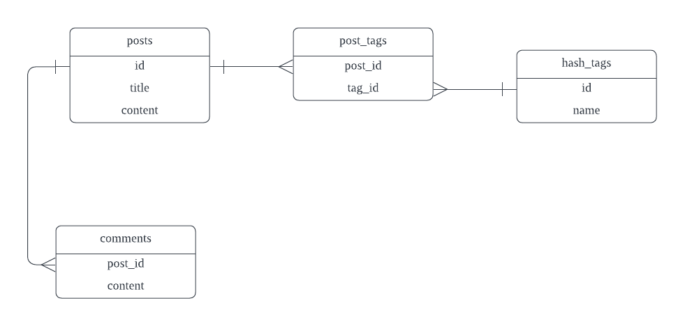

# Perform Complex Queries with jOOQ and R2dbc

R2dbc makes it possible to access traditional RDBMS in reactive programming, but unfortunately Spring R2dbc and Spring Data R2dbc can not process complex relations as Jakarta Persistence(aka JPA) and Spring Data JPA, Spring Data R2dbc does not support Embeddable, one to many, many to one, etc., when performing a complex query that crossing multiple tables, you have to aggregate result from a collection of small queries, or return back to execute SQL using the raw R2dbc API.

The jOOQ as an alternative solution to execute type-safe SQL queries on traditional RDBMS is very popular in Java communities. Since 3.15, [jOOQ starts to embrace R2dbc](https://blog.jooq.org/reactive-sql-with-jooq-3-15-and-r2dbc/), that means we can utilize jOOQ to hand over the tedious multiple-table query work.

Unfortunately, Spring Boot starter jOOQ only supports Jdbc, check the issue [spring-boot#30760](https://github.com/spring-projects/spring-boot/issues/30760). But integrating jOOQ with R2dbc manually is not complex, it just needs a couple lines of codes. 

## Generating Project Skeleton
Generate a Spring Boot project from [Spring initializr](https://start.spring.io).
* Dependencies: Reactive Web, Data R2dbc, Postgres, Testcontainers, Lombok, etc.
* Language: Java
* Project Metadata/Java: 21
* Project(Build Tools): Maven

Use default values ​​for other options.

Import the project source codes into your IDE. 

## Setup Database

We still use the blog application as example, it just includes two tables: `posts` and `comments`. 

To demonstrate the table relationship required in this post, we change the database schema slightly.



* Add a new `hash_tags` table
* Add a new `post_tags` relationship table that connects to `posts` table and `tags` table.

When using R2dbc/Spring Data R2dbc, we have to prepare the database schema ourselves.

Firstly, add a schema script file *schema.sql* in the *src/main/resources* folder.

```sql
CREATE TABLE IF NOT EXISTS posts (
    id UUID NOT NULL/* [jooq ignore start] */ DEFAULT  uuid_generate_v4()/* [jooq ignore stop] */,
    title VARCHAR(255),
    content VARCHAR(255),
    status VARCHAR(255) default 'DRAFT',
    created_at TIMESTAMP , --NOT NULL DEFAULT LOCALTIMESTAMP,
    updated_at TIMESTAMP , --NOT NULL DEFAULT LOCALTIMESTAMP,
    version INTEGER
);

CREATE TABLE IF NOT EXISTS comments (
    id UUID  NOT NULL /* [jooq ignore start] */DEFAULT uuid_generate_v4()/* [jooq ignore stop] */,
    content VARCHAR(255),
    created_at TIMESTAMP , --NOT NULL DEFAULT LOCALTIMESTAMP,
    post_id UUID NOT NULL
);

CREATE TABLE IF NOT EXISTS hash_tags (
    id UUID NOT NULL /* [jooq ignore start] */DEFAULT uuid_generate_v4()/* [jooq ignore stop] */,
    name VARCHAR(255)
);

CREATE TABLE IF NOT EXISTS posts_tags (
    post_id UUID NOT NULL,
    tag_id UUID NOT NULL
);

-- drop constraints
ALTER TABLE posts_tags DROP CONSTRAINT IF EXISTS fk_posts_tags_to_hash_tags;
ALTER TABLE posts_tags DROP CONSTRAINT IF EXISTS fk_posts_tags_to_posts;
ALTER TABLE hash_tags DROP CONSTRAINT IF EXISTS pk_hash_tags;
ALTER TABLE comments DROP CONSTRAINT IF EXISTS fk_comments_to_posts;
ALTER TABLE comments DROP CONSTRAINT IF EXISTS pk_comments;
ALTER TABLE posts DROP CONSTRAINT IF EXISTS pk_posts;

-- add constraints
ALTER TABLE posts ADD CONSTRAINT  pk_posts PRIMARY KEY (id);
ALTER TABLE comments ADD CONSTRAINT  pk_comments PRIMARY KEY (id);
ALTER TABLE comments ADD CONSTRAINT  fk_comments_to_posts FOREIGN KEY (post_id) REFERENCES posts (id) /* [jooq ignore start] */ ON DELETE CASCADE/* [jooq ignore stop] */;
ALTER TABLE hash_tags ADD CONSTRAINT  pk_hash_tags PRIMARY KEY (id);
ALTER TABLE posts_tags ADD CONSTRAINT  fk_posts_tags_to_posts FOREIGN KEY (post_id) REFERENCES posts (id) /* [jooq ignore start] */ MATCH FULL/* [jooq ignore stop] */;
ALTER TABLE posts_tags ADD CONSTRAINT  fk_posts_tags_to_hash_tags FOREIGN KEY (tag_id) REFERENCES hash_tags (id) /* [jooq ignore start] */ MATCH FULL/* [jooq ignore stop] */;
```
Optionally, create a data file *data.sql* in the same folder.

```sql
DELETE FROM posts;
INSERT INTO  posts (title, content) VALUES ('R2dbc is refined', 'R2dbc is now part of Spring framework core');
```

Then add a property into the *application.properties* file to ensure the schema files will be picked up and executed at the application startup.

```properties
# embedded, always
spring.sql.init.mode=always
```
To bootstrap a Postgres instance quickly in development stage, Docker or Docker compose is a good choice. 

There is a [docker-compose.yaml file](https://github.com/hantsy/spring-r2dbc-sample/blob/master/docker-compose.yml) in the repository root to serve the database we use in the example projects.

```yaml
services:
  postgres:
    image: postgres
    ports:
      - "5432:5432"
    restart: always
    environment:
      POSTGRES_PASSWORD: password
      POSTGRES_DB: blogdb
      POSTGRES_USER: user
    volumes:
      - ./data/postgresql:/var/lib/postgresql
      - ./pg-initdb.d:/docker-entrypoint-initdb.d
```

Add the following R2dbc connection related properties to the *application.properties*. 

```properties
spring.r2dbc.url=r2dbc:postgresql://localhost/blogdb
spring.r2dbc.username=user
spring.r2dbc.password=password
```

Open a terminal, switch to the directory that includes the *docker-compose.yaml* file, run the following command to start up a Postgres in docker.

```bash
docker compose up postgres
```

Start up *Application* in IDE or run the following command in the project root folder.

```bash 
mvn clean spring-boot:run
```

You will see some logs like this in the console.

```bash 
...
2024-09-24T09:33:12.913+08:00 DEBUG 5468 --- [actor-tcp-nio-1] o.s.r2dbc.connection.init.ScriptUtils    : 
Executed SQL script from file [D:\hantsylabs\spring-r2dbc-sample\jooq\target\classes\schema.sql] in 295 ms.
...
2024-09-24T09:33:12.953+08:00 DEBUG 5468 --- [actor-tcp-nio-1] o.s.r2dbc.connection.init.ScriptUtils    : 
Executed SQL script from file [D:\hantsylabs\spring-r2dbc-sample\jooq\target\classes\data.sql] in 27 ms.
```

Verify the database schema is created in the running database.

```bash 
#docker ps
CONTAINER ID   IMAGE      COMMAND                  CREATED          STATUS          PORTS                    NAMES
93101d83dfbf   postgres   "docker-entrypoint.s…"   10 minutes ago   Up 10 minutes   0.0.0.0:5432->5432/tcp   spring-r2dbc-sample-postgres-1

#docker exec -it 93101d83dfbf bash
### here the command line is switched into bash in the specified docker container. ###
> root@93101d83dfbf:/# psql -h localhost -p 5432 -U user --dbname blogdb
psql (15.3 (Debian 15.3-1.pgdg110+1))
Type "help" for help.


> blogdb-# \d posts
                                     Table "public.posts"
   Column   |            Type             | Collation | Nullable |          Default
------------+-----------------------------+-----------+----------+----------------------------
 id         | uuid                        |           | not null | uuid_generate_v4()
 title      | character varying(255)      |           |          |
 content    | character varying(255)      |           |          |
 status     | character varying(255)      |           |          | 'DRAFT'::character varying
 created_at | timestamp without time zone |           |          |
 updated_at | timestamp without time zone |           |          |
 version    | integer                     |           |          |
Indexes:
    "pk_posts" PRIMARY KEY, btree (id)
Referenced by:
    TABLE "comments" CONSTRAINT "fk_comments_to_posts" FOREIGN KEY (post_id) REFERENCES posts(id) ON DELETE CASCADE
    TABLE "posts_tags" CONSTRAINT "fk_posts_tags_to_posts" FOREIGN KEY (post_id) REFERENCES posts(id) MATCH FULL
```

## Configure jOOQ

Open *pom.xml*, and add jOOQ dependencies.

```xml
<dependency>
    <groupId>org.jooq</groupId>
    <artifactId>jooq</artifactId>
    <version>${jooq.version}</version>
</dependency>
<dependency>
    <groupId>org.jooq</groupId>
    <artifactId>jooq-meta-extensions</artifactId>
    <version>${jooq.version}</version>
</dependency>
```
Declare a property `jooq.version`.

```xml
<properties>
    //...
    <jooq.version>3.19.11</jooq.version>
</properties>
```
Add jOOQ maven plugin to generate table metadata of the table definitions and foreign keys.

```xml
<plugin>
    <groupId>org.jooq</groupId>
    <artifactId>jooq-codegen-maven</artifactId>
    <executions>
        <execution>
            <id>generate-postgres</id>
            <phase>generate-sources</phase>
            <goals>
                <goal>generate</goal>
            </goals>
            <configuration>
                <generator>
                    <database>
                        <name>org.jooq.meta.extensions.ddl.DDLDatabase</name>
                        <properties>
                            <!-- Specify the location of your SQL script.
                                    You may use ant-style file matching, e.g. /path/**/to/*.sql

                                    Where:
                                    - ** matches any directory subtree
                                    - * matches any number of characters in a directory / file name
                                    - ? matches a single character in a directory / file name -->
                            <property>
                                <key>scripts</key>
                                <value>src/main/resources/schema.sql</value>
                            </property>
                            <!-- The sort order of the scripts within a directory, where:

                                    - semantic: sorts versions, e.g. v-3.10.0 is after v-3.9.0 (default)
                                    - alphanumeric: sorts strings, e.g. v-3.10.0 is before v-3.9.0
                                    - flyway: sorts files the same way as flyway does
                                    - none: doesn't sort directory contents after fetching them from the directory -->
<!--                                        <property>-->
<!--                                            <key>sort</key>-->
<!--                                            <value>semantic</value>-->
<!--                                        </property>-->
                            <!-- The default schema for unqualified objects:

                                    - public: all unqualified objects are located in the PUBLIC (upper case) schema
                                    - none: all unqualified objects are located in the default schema (default)

                                    This configuration can be overridden with the schema mapping feature -->
                            <property>
                                <key>unqualifiedSchema</key>
                                <value>none</value>
                            </property>
                            <!-- The default name case for unquoted objects:

                                    - as_is: unquoted object names are kept unquoted
                                    - upper: unquoted object names are turned into upper case (most databases)
                                    - lower: unquoted object names are turned into lower case (e.g. PostgreSQL) -->
                            <property>
                                <key>defaultNameCase</key>
                                <value>lower</value>
                            </property>
                        </properties>
                    </database>
                    <target>
                        <packageName>com.example.demo.jooq</packageName>
                    </target>
                </generator>
            </configuration>
        </execution>
    </executions>
</plugin>
```

We configured the jOOQ plugin to generate metadata from scripts. In the above *schema.sql*, there are comment pairs starts with `/* [jooq ignore start]*/` and ends with `/* [jooq ignore stop] */`, it is used to notify jOOQ generator to skip the content between them, because these SQL syntax are not recognized by jOOQ generator and will fail the metadata generation.

> NOTE: more details about the jOOQ maven plugin, check the official [Running the code generator with Maven](https://www.jooq.org/doc/latest/manual/code-generation/codegen-maven/).

Open a terminal window, execute `mvn clean compile`, and wait for seconds, there are a couple of database metadata 
classes are generated in the *target/generated-sources/jooq* folder.

```bash
\---com
    \---example
        \---demo
            \---jooq
                |   DefaultCatalog.java
                |   DefaultSchema.java
                |   Keys.java
                |   Tables.java
                |
                \---tables
                    |   Comments.java
                    |   HashTags.java
                    |   Posts.java
                    |   PostsTags.java
                    |
                    \---records
                            CommentsRecord.java
                            HashTagsRecord.java
                            PostsRecord.java
                            PostsTagsRecord.java
```   


Add a simple configuration to integrate jOOQ with R2dbc.

```java
@Configuration
class JooqConfig {

    @Bean
    DSLContext dslContext(ConnectionFactory connectionFactory) {
        return DSL.using(
                new TransactionAwareConnectionFactoryProxy(connectionFactory),
                SQLDialect.POSTGRES
        );
    }
}
```
This configuration just declares a `DSLContext` bean, here we use a `TransactionAwareConnectionFactoryProxy` to wrap the existing R2dbc `ConnectionFactory` bean that binds Spring transaction to the connection lifecycle.

> Note, this simple configuration resolves the R2dbc connection issue, but we will lost other feature that provided in the starter jOOQ(for Jdbc), eg. Spring Transaction Management, data types, custom converters, etc. 

## Create Table Entity and Repository Classes

Create R2dbc entity classes that mapped to the tables.

```java
@Getter
@Setter
@ToString
@Builder
@NoArgsConstructor
@AllArgsConstructor
@Table(value = "posts")
class Post {

    @Id
    @Column("id")
    private UUID id;

    @Column("title")
    private String title;

    @Column("content")
    private String content;

    @Column("status")
    @Builder.Default
    private Status status = Status.DRAFT;

    @Column("created_at")
    @CreatedDate
    private LocalDateTime createdAt;

    @Column("created_by")
    @CreatedBy
    private String createdBy;

    @Column("updated_at")
    @LastModifiedDate
    private LocalDateTime updatedAt;

    @Column("version")
    @Version
    private Long version;
}

enum Status {
    DRAFT, PENDING_MODERATION, PUBLISHED;
}

@Getter
@Setter
@ToString
@Builder
@NoArgsConstructor
@AllArgsConstructor
@Table(value = "comments")
class Comment {

    @Id
    @Column("id")
    private UUID id;

    @Column("content")
    private String content;

    @Column("created_at")
    @CreatedDate
    private LocalDateTime createdAt;

    @Column("post_id")
    private UUID postId;
}

@Getter
@Setter
@ToString
@Builder
@NoArgsConstructor
@AllArgsConstructor
@Table(value = "hash_tags")
class HashTag {

    @Id
    @Column("id")
    private UUID id;

    @Column("name")
    private String name;
}

@Getter
@Setter
@ToString
@Builder
@NoArgsConstructor
@AllArgsConstructor
@Table(value = "posts_tags")
class PostTagRelation {

    @Column("post_id")
    private UUID postId;

    @Column("tag_id")
    private UUID tagId;
}
```
Create repositories for the entity classes.

```java
interface PostRepository extends R2dbcRepository<Post, UUID> {

    @Query("SELECT * FROM posts where title like :title")
    public Flux<Post> findByTitleContains(String title);
}

interface CommentRepository extends R2dbcRepository<Comment, UUID> {
}

interface HashTagRepository extends R2dbcRepository<HashTag, UUID> {
}

interface PostTagRelationRepository extends R2dbcRepository<PostTagRelation, UUID> {
}
```

## Testing Repository and DSLContext

Create a `PostRepositoryTest` to verify the Spring Data R2dbc and jOOQ functionalities.

```java
@Testcontainers
@DataR2dbcTest()
@Slf4j
public class PostRepositoryTest {

    @Container
    static PostgreSQLContainer postgreSQLContainer = new PostgreSQLContainer<>("postgres:12")
            .withCopyFileToContainer(
                    MountableFile.forClasspathResource("init.sql"),
                    "/docker-entrypoint-initdb.d/init.sql"
            );

    @DynamicPropertySource
    static void registerDynamicProperties(DynamicPropertyRegistry registry) {
        registry.add("spring.r2dbc.url", () -> "r2dbc:postgresql://"
                + postgreSQLContainer.getHost() + ":" + postgreSQLContainer.getFirstMappedPort()
                + "/" + postgreSQLContainer.getDatabaseName());
        registry.add("spring.r2dbc.username", () -> postgreSQLContainer.getUsername());
        registry.add("spring.r2dbc.password", () -> postgreSQLContainer.getPassword());
    }

    @TestConfiguration
    @Import(JooqConfig.class)
    static class TestConfig {
    }

    @Autowired
    R2dbcEntityTemplate template;

    @Autowired
    PostRepository posts;

    @Autowired
    DSLContext dslContext;

    @SneakyThrows
    @BeforeEach
    public void setup() {
        var latch = new CountDownLatch(1);
        this.template.delete(Comment.class).all()
                .then(this.template.delete(PostTagRelation.class).all())
                .then(this.template.delete(Post.class).all())
                .doOnTerminate(latch::countDown)
                .subscribe();
        latch.await(1000, TimeUnit.MILLISECONDS);
    }

    @Test
    public void testDatabaseClientExisted() {
        assertNotNull(template);
    }

    @Test
    public void testPostRepositoryExisted() {
        assertNotNull(posts);
    }

    @Test
    public void testDslContextExisted() {
        assertNotNull(dslContext);
    }

    @SneakyThrows
    @Test
    public void testInsertAndQuery() {

        var latch = new CountDownLatch(1);

        var data = Post.builder().title("test title").content("content of test").build();
        this.template.insert(data)
                .flatMapMany(
                        p -> Flux.just(1, 2, 3).map(i -> Comment.builder().postId(p.getId()).content("comment #" + i).build())
                                .flatMap(c -> this.template.insert(c))
                )
                .doOnTerminate(latch::countDown)
                .subscribe();
        latch.await(1000, TimeUnit.MILLISECONDS);

        var p = Tables.POSTS;
        var c = Tables.COMMENTS;

        var selectSql = dslContext.select(
                        p.ID,
                        p.TITLE,
                        multiset(
                                select(c.CONTENT)
                                        .from(c)
                                        .where(c.POST_ID.eq(p.ID))
                        ).as("comments")
                )
                .from(p)
                .orderBy(p.CREATED_AT.desc());
        Flux.from(selectSql)
                .as(StepVerifier::create)
                .consumeNextWith(r -> {
                            log.info("saved post: {}", r.formatJSON());
                            assertThat(r.value2()).isEqualTo("test title");
                            assertThat(r.value3().map(Record1::value1)).containsExactlyInAnyOrder("comment #1", "comment #2", "comment #3");
                        }
                )
                .verifyComplete();

    }
}
```

In the test `testInsertAndQuery`, we use Spring Data R2dbc template to insert sample data, and use jOOQ `DSLContext` to assemble complex queries to fetch the result as expected.
* The high-level jOOQ select is derived from ReactiveStreams `Publisher`, use Reactor `Mono` or `Flux` to wrap the select and can subscribe the result in the stream.
* In the above test, we use the SQL function `multiset` to aggregate the comments into one line.

## Perform Complex Query using DSLContext

Assume we face a bit complex cases, for examples,
* Get the post summary list with comments count, tag names.
* Paginate the result with data list and count.
* Create a post with selected tag ids.

Create a new `BlogService` and use jOOQ `DSLContext` to handle these scenarios.

```java
@Service
@RequiredArgsConstructor
@Slf4j
class PostService {
    private final DSLContext dslContext;

    public Flux<PostSummary> findAll() {
        var p = POSTS;
        var pt = POSTS_TAGS;
        var t = HASH_TAGS;
        var c = COMMENTS;
        var sql = dslContext.select(
                        p.ID,
                        p.TITLE,
                        DSL.field("count(comments.id)", SQLDataType.BIGINT),
                        multiset(select(t.NAME)
                                .from(t)
                                .join(pt).on(t.ID.eq(pt.TAG_ID))
                                .where(pt.POST_ID.eq(p.ID))
                        ).as("tags")
                )
                .from(p.leftJoin(c).on(c.POST_ID.eq(p.ID)))
                .groupBy(p.ID)
                .orderBy(p.CREATED_AT);
        return Flux.from(sql)
                .map(r -> new PostSummary(r.value1(), r.value2(), r.value3(), r.value4().map(Record1::value1)));
    }

    public Mono<PaginatedResult> findByKeyword(String keyword, int offset, int limit) {
        var p = POSTS;
        var pt = POSTS_TAGS;
        var t = HASH_TAGS;
        var c = COMMENTS;

        Condition where = DSL.trueCondition();
        if (StringUtils.hasText(keyword)) {
            where = where.and(p.TITLE.likeIgnoreCase("%" + keyword + "%"));
        }
        var dataSql = dslContext.select(
                        p.ID,
                        p.TITLE,
                        DSL.field("count(comments.id)", SQLDataType.BIGINT),
                        multiset(select(t.NAME)
                                .from(t)
                                .join(pt).on(t.ID.eq(pt.TAG_ID))
                                .where(pt.POST_ID.eq(p.ID))
                        ).as("tags")
                )
                .from(p.leftJoin(c).on(c.POST_ID.eq(p.ID)))
                .where(where)
                .groupBy(p.ID)
                .orderBy(p.CREATED_AT)
                .limit(offset, limit);

        val countSql = dslContext.select(DSL.field("count(*)", SQLDataType.BIGINT))
                .from(p)
                .where(where);

        return Mono
                .zip(
                        Flux.from(dataSql)
                                .map(r -> new PostSummary(r.value1(), r.value2(), r.value3(), r.value4().map(Record1::value1)))
                                .collectList(),
                        Mono.from(countSql)
                                .map(Record1::value1)
                )
                .map(it -> new PaginatedResult(it.getT1(), it.getT2()));
    }

    public Mono<UUID> create(CreatePostCommand data) {
        var p = POSTS;
        var pt = POSTS_TAGS;
        var sqlInsertPost = dslContext.insertInto(p)
                .columns(p.TITLE, p.CONTENT)
                .values(data.title(), data.content())
                .returningResult(p.ID);
        return Mono.from(sqlInsertPost)
                .flatMap(id -> {
                            Collection<?> tags = data.tagId().stream().map(tag -> {
                                PostsTagsRecord r = pt.newRecord();
                                r.setPostId(id.value1());
                                r.setTagId(tag);
                                return r;
                            }).toList();
                            return Mono.from(dslContext.insertInto(pt)
                                            .columns(pt.POST_ID, pt.TAG_ID)
                                            .values(tags)
                                    )
                                    .map(r -> {
                                        log.debug("inserted tags:: {}", r);
                                        return id;
                                    });
                        }
                )
                .map(Record1::value1);
    }
}

record CreatePostCommand(String title, String content, List<UUID> tagId) {
}

record PostSummary(UUID id, String title, Long countOfComments, List<String> tags) {
}

record PaginatedResult(List<?> data, Long count) {
}
```

Create a `DataInitializer` to insert some sample data. 

```java
@Configuration
@RequiredArgsConstructor
@Slf4j
class DataInitializer {
    private final DSLContext dslContext;

    @EventListener(classes = ApplicationReadyEvent.class)
    public void init() {
        Mono.from(dslContext.insertInto(POSTS)
                        .columns(POSTS.TITLE, POSTS.CONTENT)
                        .values("jooq test", "content of Jooq test")
                        .returningResult(POSTS.ID)
                )
                .flatMapMany(id -> dslContext.insertInto(COMMENTS)
                        .columns(COMMENTS.POST_ID, COMMENTS.CONTENT)
                        .values(id.component1(), "test comments")
                        .values(id.component1(), "test comments 2")
                )
                .flatMap(it -> dslContext.select(POSTS.TITLE,
                                        POSTS.CONTENT,
                                        multiset(select(COMMENTS.CONTENT)
                                                .from(COMMENTS)
                                                .where(COMMENTS.POST_ID.eq(POSTS.ID))
                                        ).as("comments")
                                )
                                .from(POSTS)
                                .orderBy(POSTS.CREATED_AT)

                )
                .subscribe(
                        data -> log.debug("saving data: {}", data.formatJSON()),
                        error -> log.debug("error: " + error),
                        () -> log.debug("done")
                );
    }
}
```
The `ApplicationReadyEvent` is a Spring Boot built-in event, will be triggered when the application is started.

Create a simple `PostHandler` to handle HTTP request/response, and use `RouterFunction` bean to assemble the handler and routes.

```java
@Component
@RequiredArgsConstructor
class PostHandler {
    private final PostService postService;

    public Mono<ServerResponse> getAll(ServerRequest req) {
        return ok().body(this.postService.findAll(), PostSummary.class);
    }

    public Mono<ServerResponse> create(ServerRequest req) {
        return req.bodyToMono(CreatePostCommand.class)
                .flatMap(this.postService::create)
                .flatMap(id -> created(URI.create("/posts/" + id)).build());
    }

}

@Configuration
class WebConfig {

    @Bean
    RouterFunction<ServerResponse> routerFunction(PostHandler handler) {
        return route()
                .GET("/posts", handler::getAll)
                .POST("/posts", handler::create)
                .build();
    }
}
```

Make sure the Postgres database is running, and start up the application. Open a terminal window, and test the endpoint.

```bash 
# curl http://localhost:8080/posts
[{"id":"06c90101-3b57-447f-b435-efe470b0312e","title":"R2dbc is refined","countOfComments":0,"tags":[]},
{"id":"2035379a-9704-4b5b-bc99-ce264a496a7b","title":"jooq test","countOfComments":2,"tags":[]}]
```

Check the complete [sample codes](https://github.com/hantsy/spring-r2dbc-sample/blob/master/jooq) from my Github account.
